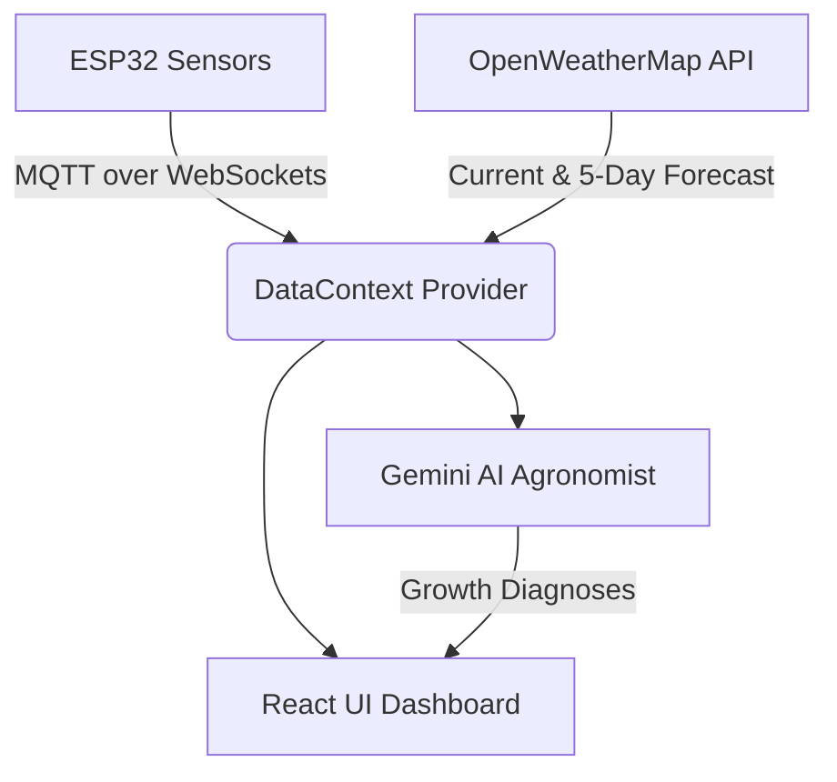

# 🌿 TRI-HITA (Smart Plantation & Hydroponic Monitor)

<p align="center">
  
</p>

<div align="center">

[](https://vitejs.dev/)
[](https://reactjs.org/)
[](https://mqtt.org/)
[](https://ai.google.dev/)

**Harmonizing technology and agriculture through the spirit of *Tri Hita Karana* (Palemahan — Harmony with Nature).**

</div>

---

## 📖 Overview & Scientific Background

**TRI-HITA** is a premium, mobile-first Web application designed for real-time monitoring and automation of smart plantation and hydroponic farming systems. Built on the philosophical foundation of Balinese *Tri Hita Karana*, the system aims to create ecological balance by combining **IoT Telemetry (ESP32)**, **Google Gemini AI Analytics**, and **Interactive Weather Forecasting**.

### 🔬 Context & Ecological Mission
The escalating volume of municipal organic waste poses a significant threat to Bali's ecological stability, necessitating a transition toward source-level management and sustainable urban agriculture. Rapid urbanization in Denpasar and surrounding agglomerations has overwhelmed centralized waste management systems, notably the over-capacity **Suwung Landfill (TPA Suwung)**, resulting in toxic groundwater contamination, coastal degradation, and hazardous landfill methane fires. 

The TRI-HITA ecosystem provides a scalable solution by synchronizing aerobic composting processes with closed-loop hydroponic irrigation. By converting domestic organic residuals (fruit peels, vegetable scraps, and household bio-waste) into nutrient-rich organic leachate, the system extracts essential minerals (N, P, K) that perform comparably to synthetic fertilizers, containing natural plant growth hormones (auxins, gibberellins, cytokinins) and beneficial microflora that boost tissue regeneration while mitigating carbon emissions.

### ⚡ The Technological Intervention
The complex environmental balance required for simultaneous composting and hydroponics presents a significant barrier to household adoption. The TRI-HITA system overcomes this through a hybrid IoT and AI framework:
* **Edge Computing:** An ESP32 microcontroller integrated with DHT11 and soil moisture sensors manages real-time irrigation autonomously with zero-latency logic.
* **AI Decision-Support System (DSS):** Translates complex telemetry streams into intuitive, actionable agronomic advice for the user using cloud-based AI analytics.

By aligning decentralized technological interventions with the **Palemahan** (environmental harmony) pillar of Balinese wisdom, the system enhances communal food security and mitigates urban environmental degradation.

---

## ✨ Key Features



### 📱 Real-Time Dashboard
* **Dynamic Header & Location:** Displays live weather conditions and resolved location name directly from GPS.
* **3-Column Stat Pills:** Displays real-time **Plant Health**, **Hardware Status**, and active **Notification Alerts**.
* **Area Charts:** Displays crop parameters over customizable ranges (3 days, 1 week, 1 month).

### 🤖 Gemini AI Agronomist
* Built-in expert chatbot (**TRI-HITA AI**) to answer questions.
* Automatic contextual prompts summarizing live **Soil Moisture, Temperature, Humidity, and UV Index** for high-accuracy agronomist diagnostic reports.

### 🌦️ Google Weather-Style Forecast
* **Pill-Selector Tab:** Toggles smooth Area Chart lines showing hourly predictions for **Temperature**, **Precipitation**, and **Wind**.
* **7-Day Forecast:** Displays daily forecast cards with temperatures and weather emojis.
* **Fail-safe Geolocation:** Requests high-precision GPS coordinates from user devices, falling back to Denpasar, Bali coordinates if blocked.

---

## 🛠️ Tech Stack

* **Frontend:** React (v19) + Vite
* **Styling:** Vanilla CSS (Glassmorphic cards, Harmonious forest HSL color palettes, active micro-animations)
* **Real-time Telemetry:** MQTT over WebSockets
* **Charts:** Recharts
* **AI Engine:** `@google/generative-ai` (Gemini 2.5 Flash)
* **Weather Service:** OpenWeatherMap API + Nominatim Reverse Geocoder

---

## 🚀 Getting Started

### 1. Prerequisites
Ensure you have Node.js (v18+) and npm installed.

### 2. Configuration (`.env`)
Create a `.env` file in the root directory and add your keys:
```env
# Gemini API Key for AI Diagnostics & Chatbot
VITE_GEMINI_API_KEY=your_gemini_api_key_here

# OpenWeatherMap API Key
VITE_OPENWEATHER_API_KEY=your_openweather_api_key_here

# Base URL for Backend REST API (Optional)
VITE_API_BASE_URL=
```

### 3. Installation
```bash
# Clone the repository
git clone https://github.com/username/tri-hita-app.git
cd tri-hita-app

# Install dependencies
npm install

# Start local development server
npm run dev
```

### 4. Build for Production
```bash
npm run build
```

---

## 📐 Architecture

```
TRI-HITA APP/
├── src/
│   ├── components/       # Custom components (AIChatbot, StatCard, SprinklerControl)
│   ├── context/          # Context states (DataContext, UserContext, LanguageContext)
│   ├── lib/              # API and MQTT helpers
│   ├── pages/            # View pages (Dashboard, Analysis, Settings, Account)
│   ├── App.jsx           # Routing and core nav layout
│   └── main.jsx          # Root entrypoint
├── .env                  # Environment keys config
└── package.json          # Node dependencies
```

---

<p align="center" style="font-size: 13px; color: #7d9690;">
  Made with 💚 to preserve harmony with nature.
</p>
# TRI-HITA
